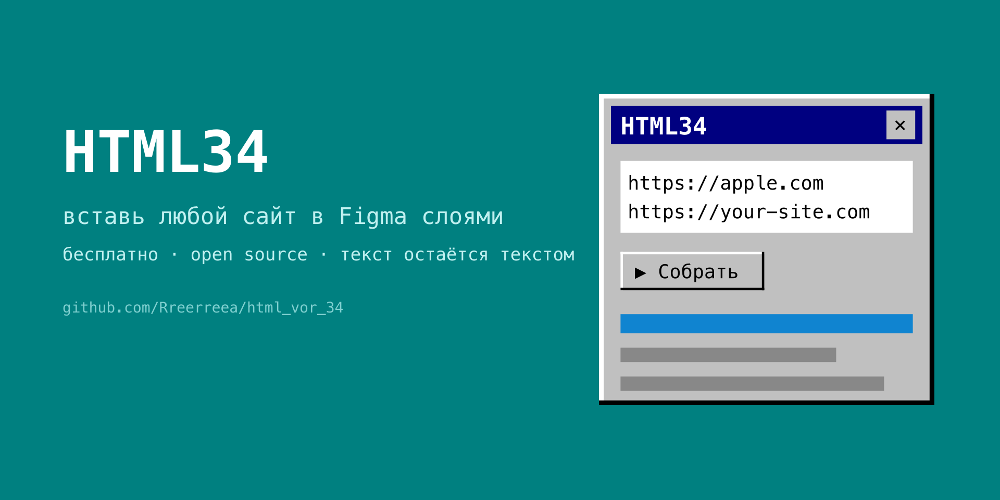

# HTML34 — website → Figma



**Import any website into Figma as editable layers. Free & open source.**

Paste a URL — get real Figma frames: live text (not vector outlines), Auto Layout for flex containers, images, gradients, clean layer names. Retro Windows 95 interface with a built-in radio and mini-games while you wait.

[English](#install) · [Русский](#html34-по-русски)

---

## Install

**From Figma Community** — coming soon (plugin is in review).

**Manual install (2 minutes):**

1. Click the green **Code** button above → **Download ZIP** → unzip.
2. Open the **Figma desktop app** (manual install doesn't work in the browser).
3. Menu (Figma logo, top-left) → **Plugins → Development → Import plugin from manifest…**
4. Pick `plugin/manifest.json` from the unzipped folder.
5. Run it: **Plugins → Development → HTML34**.

## Usage

1. Open the plugin, paste one or more URLs (one per line).
2. Set viewport width (default 1440 px), hit **▶ Build**.
3. Frames appear side by side on the canvas. Language switch (EN/RU) — top-left button.

What you get:

- **Editable text** with real line breaks — text stays text
- **Auto Layout** for even flex flows; absolute positioning preserved
- Images (WebP/AVIF converted, oversized bitmaps resized to Figma's 4096 px limit)
- Gradients, per-side borders, object-fit, z-order
- **Clean layer tree**: wrapper divs collapsed, meaningful layer names
- Batch import, credits mini-games (clicker & mine), SomaFM radio

## How it works

```
Figma plugin (UI + builder)  →  render server (Node + Playwright + sharp)
        builds nodes         ←  JSON: tree + styles + images
```

The server opens the page in headless Chromium, serializes DOM + computed styles + geometry, downloads and normalizes images, and returns one JSON. The plugin rebuilds it as native Figma nodes. Pages are processed in memory and not stored — see [PRIVACY.md](PRIVACY.md).

## Self-host the server (optional)

The plugin uses the author's public server by default. To run your own:

```bash
cd server
npm install
npx playwright install --with-deps chromium
node server.js   # → http://localhost:3789
```

Then point `CLOUD` in `plugin/ui.html` to your address and re-import the manifest. Env knobs: `PORT`, `MAX_CONCURRENT`, `RATE_MAX`, `TG_TOKEN`/`TG_CHAT` (feedback forwarding to Telegram).

## Feedback & news

- 🐞 **Found a bug?** — report right from the plugin footer
- 📰 News & updates — [t.me/forgegeorge](https://t.me/forgegeorge)
- ☕ [Donate](https://pay.cloudtips.ru/p/2c12c3c2)

Import only websites you have the rights to use.

---

## HTML34 по-русски

Вставляешь ссылку — получаешь настоящий редактируемый макет в Figma: живой текст (не кривые), Auto Layout для flex-контейнеров, картинки, градиенты, чистые имена слоёв. Интерфейс — Windows 95 с радио и мини-играми, пока идёт сборка.

**Установка вручную:** скачай ZIP (зелёная кнопка Code выше) → распакуй → в **Figma desktop**: меню → **Plugins → Development → Import plugin from manifest…** → выбери `plugin/manifest.json`. Запуск: Plugins → Development → HTML34. Из Figma Community — скоро, плагин на ревью.

**Как пользоваться:** вставь один или несколько URL (по одному в строке), задай ширину, жми **▶ Собрать**. Переключатель языка — кнопка слева сверху.

**Свой сервер (опционально):** по умолчанию плагин ходит на публичный сервер автора; страницы обрабатываются на лету и не хранятся ([PRIVACY.md](PRIVACY.md)). Свой инстанс — см. раздел Self-host выше.

Новости — [t.me/forgegeorge](https://t.me/forgegeorge). Баг-репорт — прямо из плагина (🐞). Импортируй только сайты, на которые у тебя есть права.
